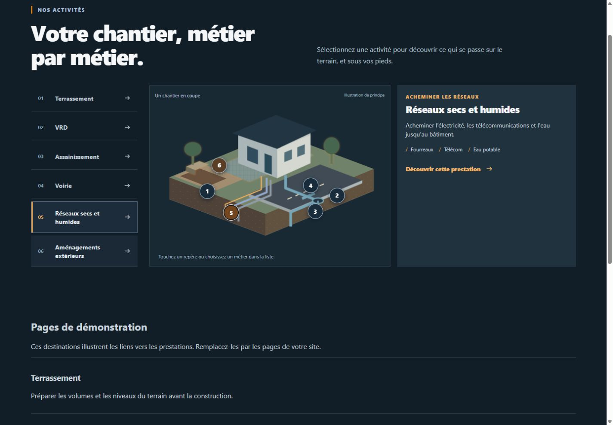

# Interactive Construction Explorer

Un composant React pour découvrir les métiers d’un chantier à travers une illustration SVG en coupe : terrassement, VRD, assainissement, voirie, réseaux et aménagements extérieurs.

Création sur mesure, développée avec une assistance IA. Le dessin est vectoriel : aucune bibliothèque 3D, aucun modèle téléchargé et aucun service externe ne sont nécessaires.



## Fonctionnalités

- Sélection d’un métier par des boutons explicites ou des repères sur le dessin.
- Mise en évidence des parties du chantier concernées.
- Fiche avec description, trois exemples, lien et photographie facultative.
- Ordinateur : liste, illustration et fiche côte à côte à partir de 1200 px.
- Téléphone : boutons sur deux colonnes, illustration puis fiche.
- Boutons natifs utilisables au clavier, état `aria-pressed`, annonce de la fiche et focus visible.
- Prise en compte de `prefers-reduced-motion`.
- Identifiants SVG et ARIA propres à chaque instance grâce à `useId`.
- Aucune photo d’entreprise, marque client, donnée privée ou clé d’API dans ce dépôt.

Le dessin est une illustration de principe, pas un plan technique d’exécution. Les fonctionnalités d’accessibilité décrites ne constituent pas une certification de conformité.

## Lancer la démonstration

Prérequis : Node.js 22.12+ ou 24+, et npm.

```sh
npm ci
npm run dev
```

Ouvrir l’adresse locale affichée par Vite. Les liens de la démonstration mènent à de vraies sections d’exemple sur la même page.

```sh
npm run check
npm run build
```

La compilation produit une démonstration statique dans `dist/`. Aucun déploiement n’est effectué automatiquement.

## Intégration dans un projet React

Copier `ConstructionExplorer.tsx` et `construction-explorer.css` dans votre projet, puis importer le composant et sa feuille de style. La démonstration `demo.tsx` contient six activités prêtes à personnaliser.

```tsx
import { ConstructionExplorer, type ConstructionActivity } from "./ConstructionExplorer";
import "./construction-explorer.css";

const activities: ConstructionActivity[] = [
  {
    id: "terrassement",
    zone: "earthwork",
    title: "Terrassement",
    description: "Préparer les volumes et les niveaux de votre terrain.",
    services: ["Décaissement", "Fouilles", "Plateformes"],
    href: "/prestations/terrassement"
  }
];

export function Services() {
  return <ConstructionExplorer activities={activities} />;
}
```

Ce dépôt distribue le code source ; il n’est pas publié comme paquet npm. React et React DOM sont les dépendances d’exécution. Vite et TypeScript servent à développer et compiler la démonstration.

### Zones disponibles

| `zone` | Partie mise en évidence |
| --- | --- |
| `earthwork` | Sol et plateforme |
| `connections` | Voirie et réseaux, pour une lecture d’ensemble des VRD |
| `drainage` | Évacuations et regard |
| `road` | Accès et revêtement |
| `utilities` | Réseaux enterrés |
| `landscaping` | Cour et abords |

Utiliser une activité par zone, avec un `id` unique. L’ordre des activités peut être personnalisé. La première activité est sélectionnée au chargement. Un tableau vide n’affiche aucun module.

### Propriétés du composant

| Propriété | Description |
| --- | --- |
| `activities` | Liste des métiers, descriptions, exemples et liens |
| `heading` | Titre personnalisable |
| `introduction` | Texte d’introduction personnalisable |
| `allActivitiesHref` | Lien facultatif vers l’ensemble des prestations |

Une activité accepte une photo facultative :

```tsx
photo: {
  src: "/photos/mon-chantier.jpg",
  alt: "Tranchées et fourreaux pendant les travaux",
  caption: "Un chantier de votre entreprise",
  href: "/realisations/mon-chantier"
}
```

Utiliser vos propres photographies avec les droits nécessaires. Elles restent absentes de la démonstration générique. Les textes et liens sont des propriétés React, pas du HTML injecté.

## Personnalisation

Les couleurs, dimensions, seuils responsive et positions des repères sont définis dans `construction-explorer.css`. Les formes du terrain, de la maison et des réseaux sont dans `ConstructionExplorer.tsx`. La perspective est dessinée en SVG 2D ; il n’y a pas de scène WebGL.

## Licence

MIT — voir [LICENSE](LICENSE). L’autorisation porte sur le code et l’illustration fournis ici, pas sur les contenus que vous ajouterez ensuite.
